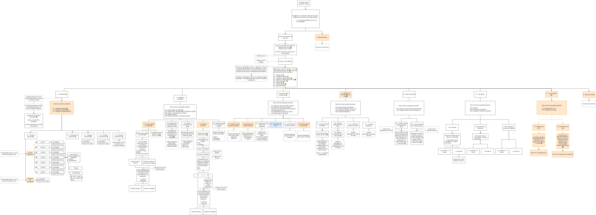
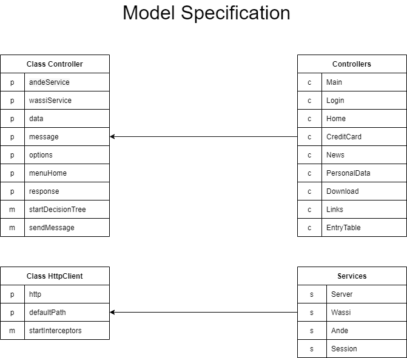

# Asistente Caja Ande

[](https://www.typescriptlang.org)
[](https://prettier.io)

Asistente virtual tipo chatbot para asistir a clientes de Caja Ande.

## Antes de Iniciar

- Activar husky

Se debe ejecutar el siguiente comando para activar `husky`.

```sh
npm run prepare
```

Esto se usa para formatear el codigo automaticamente usando prettier antes de cada commit. De esta manera el código se
mantendrá siempre organizado.

- Crear variables de entorno

Se debe crear un archivo `production.env` en la carpeta `/env`, para esto puede ejecutar el siguiente comando y copiar
la plantilla de variables proporcionada

```sh
cp template.env env/production.env
```

> Nota: crear `development.env` para usar en modo desarrollo.

## Comandos

```sh
npm install

npm run dev # Arranca la app en modo desarrollo

npm start # Arrancar la app en modo producción
```

## Diagramas

- Arbol de Decisiones



- Especificacion del modelo de codigo


